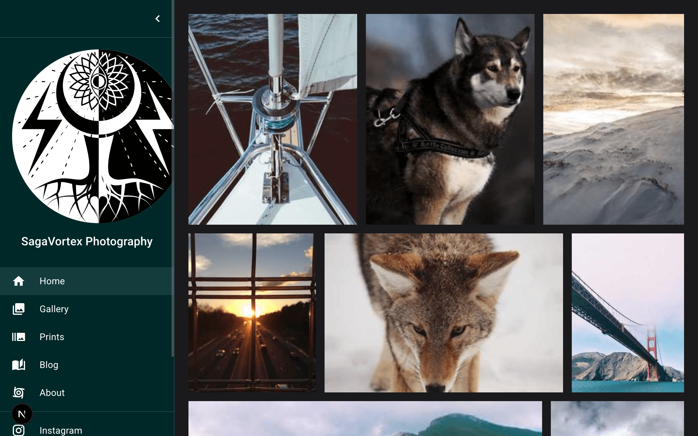

# SagaVortex Photography

A modern photography portfolio website built with Next.js, featuring a beautiful gallery, responsive design, and dynamic image loading.



## About

SagaVortex Photography is a photography portfolio website that showcases stunning landscape and nature photography. The site features:

- **Responsive Gallery**: A beautiful photo gallery with lightbox functionality
- **Dynamic Image Loading**: Images are loaded from Picsum Photos (Lorem Picsum) for demonstration purposes
- **Modern UI**: Built with Material-UI (MUI) for a polished, professional look
- **Dark/Light Theme**: Toggle between dark and light themes
- **Responsive Design**: Optimized for all screen sizes from mobile to desktop
- **Next.js Image Optimization**: Automatic image optimization and lazy loading

## Features

- 📸 Photo gallery with thumbnail grid and full-screen lightbox
- 🎨 Material-UI components for a modern interface
- 🌓 Dark and light theme support
- 📱 Fully responsive design
- ⚡ Next.js Image optimization
- 🖼️ Dynamic image loading from external sources

## Getting Started

First, install the dependencies:

```bash
npm install
# or
yarn install
# or
pnpm install
```

Then, run the development server:

```bash
npm run dev
# or
yarn dev
# or
pnpm dev
```

Open [http://localhost:3000](http://localhost:3000) with your browser to see the result.

## Project Structure

```
├── components/          # React components
│   ├── HomeGallery.js   # Main gallery component
│   ├── Layout.js        # App layout wrapper
│   └── ...
├── data/                # Data files
│   └── images.js        # Image data and metadata
├── pages/               # Next.js pages
│   ├── index.js         # Home page
│   ├── about.js         # About page
│   └── ...
├── public/              # Static assets
│   └── images/          # Local images (logos, etc.)
├── styles/              # CSS modules
└── utils/               # Utility functions
    └── images.js        # Image helper functions
```

## Image System

The website uses a dynamic image system that loads images from [Picsum Photos](https://picsum.photos/) (Lorem Picsum), a free service that provides random placeholder images. Each image is assigned a consistent seed based on its caption, ensuring the same image is displayed each time.

Images are automatically optimized by Next.js and served in different sizes based on the viewport:

- **Thumbnails**: 300px for gallery grid
- **Small (sm)**: 540px max width
- **Medium (md)**: 1080px max width
- **Large (lg)**: 1920px max width

## Technologies Used

- [Next.js](https://nextjs.org/) - React framework
- [Material-UI (MUI)](https://mui.com/) - UI component library
- [react-photo-album](https://react-photo-album.com/) - Photo gallery component
- [yet-another-react-lightbox](https://yet-another-react-lightbox.com/) - Lightbox component
- [Picsum Photos](https://picsum.photos/) - Free image service

## Learn More

To learn more about Next.js, take a look at the following resources:

- [Next.js Documentation](https://nextjs.org/docs) - learn about Next.js features and API
- [Learn Next.js](https://nextjs.org/learn) - an interactive Next.js tutorial

## Deploy on Vercel

The easiest way to deploy your Next.js app is to use the [Vercel Platform](https://vercel.com/new?utm_medium=default-template&filter=next.js&utm_source=create-next-app&utm_campaign=create-next-app-readme) from the creators of Next.js.

Check out the [Next.js deployment documentation](https://nextjs.org/docs/deployment) for more details.
